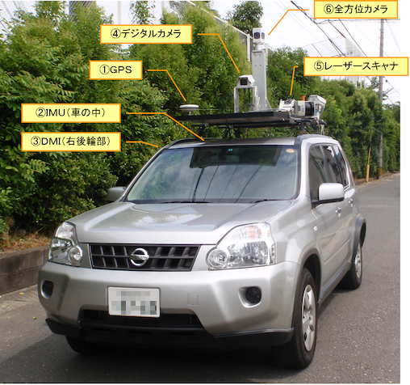
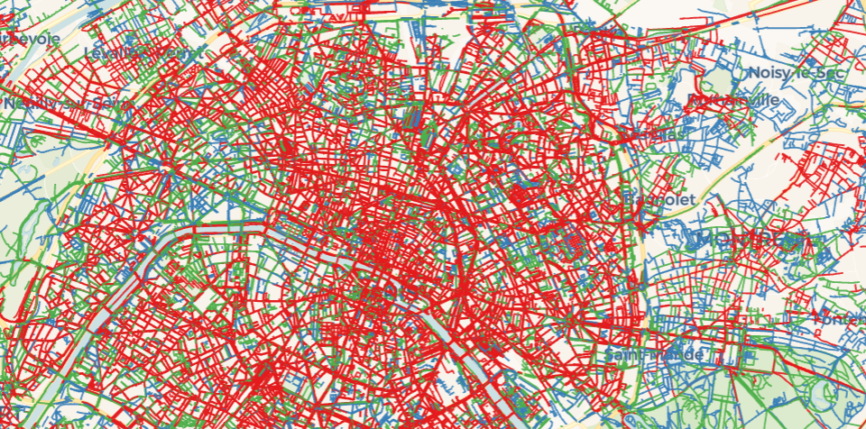

# PavementEye
## Proposal

### Introduction

Roads  are  the  most  widely  used  transportation method  around  the  world  at  present.  One  of the causes  of **accidents** on the roads  is road  **distresses[1]**. 

If left untreated,  road  distresses  will  degrade  the  ride quality and safety of motorists. They will also require **costly  maintenance**  and  repairs,  which  can  **restrict traffic flow  and cause congestion**. Therefore, timely maintenance is  essential  to keep  highways safe  and durable. [2]

---

### Problem

Roadsurface inspection is primarily based on visual observations by humans and quantitative analysis using expensive machines. Furthermore, it is timeconsuming. visual inspection tends to be inconsistent and unsustainable, which increases the risk associated with aging road infrastructure.[3] 

[4] 

---

### Solution

We propose developing an **automated data pipeline** for detecting, classifying, and geolocating road cracks and surface distresses using **computer vision** and **real-time data streaming**. The output will be visualized on a dashboard to assist urban planners and maintenance authorities in prioritizing repairs.

#### Goals

Improve road quality by applying cheap, sustainable and in an automated and fast manner. Reducing direct and indirect accidents caused by distresses. Making traffic in Egypt more resilient and reducing traffic congestion by eliminating distresses and cracks.

#### Steps

[5] 

1. Data Collection: The pipeline will start from installing smart phones on vechiles, mobile application will be developed to capture image every second.
2. Edge AI Detection: A trained deep learing model will be applyed on these edge devices to process images fast and in real time to detect cracks and distresses in images. This will significantly reduce number of images that will be sent to pipeline. Which in truns reduces cost and time by sending images only with cracks.
3. Data Ingestion and Processing: metadata such as location and images will be sent using apache Kafka to spark streaming that will process data and store images on HDFS and other metadata to cassandra database. In spark we will also combine these data with data from Open Street Map (OSM) to get the road of each distress.
4. Visualization Dashboard: Finally a dashboard on powerBI or Streamlit will be build to display that results. Results will include:
    1. **Interactive Map**: Roads colored by damage severity.
    2. **Bar Charts**: Roads ranked by number of distresses.
    3. **Hotspot Heatmaps**: High-density areas of damage.
    4. **Summary Stats**: Total crack count, area coverage, severity levels.
    
    
    
    example of “Roads colored by damage severity”
    
    
    
    The dashboard will be used by **urban planners in Egypt** to easly detect roads that need to be repaired first.
    

#### Model and datasets we will use

| **Model** | **Link** | Notes | resource |
| --- | --- | --- | --- |
| Yolo v2 (trained) | https://github.com/TITAN-lab/Road-crack-detection | Dataset are provided | [https://www.researchgate.net/publication/330622399_Automated_Road_Crack_Detection_Using_Deep_Convolutional_Neural_Networks](https://www.researchgate.net/publication/330622399_Automated_Road_Crack_Detection_Using_Deep_Convolutional_Neural_Networks) |
| SSD_mobilenet (Trained) | https://github.com/sekilab/RoadDamageDetector/ | Dataset are provided |  |

We will use trained models and search for them directly.

| **Dataset** | **Link** |  |
| --- | --- | --- |
| RDD2020: An Image Dataset for Smartphone-based Road Damage Detection and Classification | [https://drive.google.com/drive/folders/144Jlnt2xJSD3zuGG3mWtpkR0Gw1Xaxg1](https://data.mendeley.com/datasets/5ty2wb6gvg/1) | We will search for light trained models |
| EGY_PDD: Egyptian Pavement Distress Dataset | [https://psu.edu.eg/en/egy_pdd-dataset/](https://psu.edu.eg/en/egy_pdd-dataset/) |  |

We will convert this model to be able to run on flutter mobile application for real-time detection. if the accuracy is bad we will use the raw model in the backend

---

### Case study

To prove our concept we will install a mobile phone on a bike or car that will have our developed flutter application on it. It will be supposed to detect cracks in roads and send the data. And the dash board will be updated.

---

### Future work

- Use saved images on HDFS to retrain the model every week for example
- Take the project to larger scale (1000 vehicle)
- Train the model on more labels that is widely found in Egypt.

---

### Team and Tasks

---

### Reference

[1] Huang, Y.-H., & Zhang, Q.-Y., “A review of the causes and
effects of pavement distresses”, Construction and Building
Materials, Vol. 112, No. 1, pp. 294-305, 2016.

[2] Kulshreshtha, S., & Zhang, X., “Pavement distresses and
their impact on pavement performance”, Journal of
Transportation Engineering, Part B: Pavements, Vol. 143,
No. 1, pp. 1-10, 2017.

[3] Road Damage Detection Using Deep Neural Networks with
Images Captured Through a Smartphone, 2 Related Works
2.1 Road Damage Detection, Page 2

[4] [https://www.kkc.co.jp/service/item/1046/](https://www.kkc.co.jp/service/item/1046/) mobile measurement system (MMS) (KOKUSAI KOGYO CO., 2016)

[5] Road Damage Detection Using Deep Neural Networks with
Images Captured Through a Smartphone, Page 6