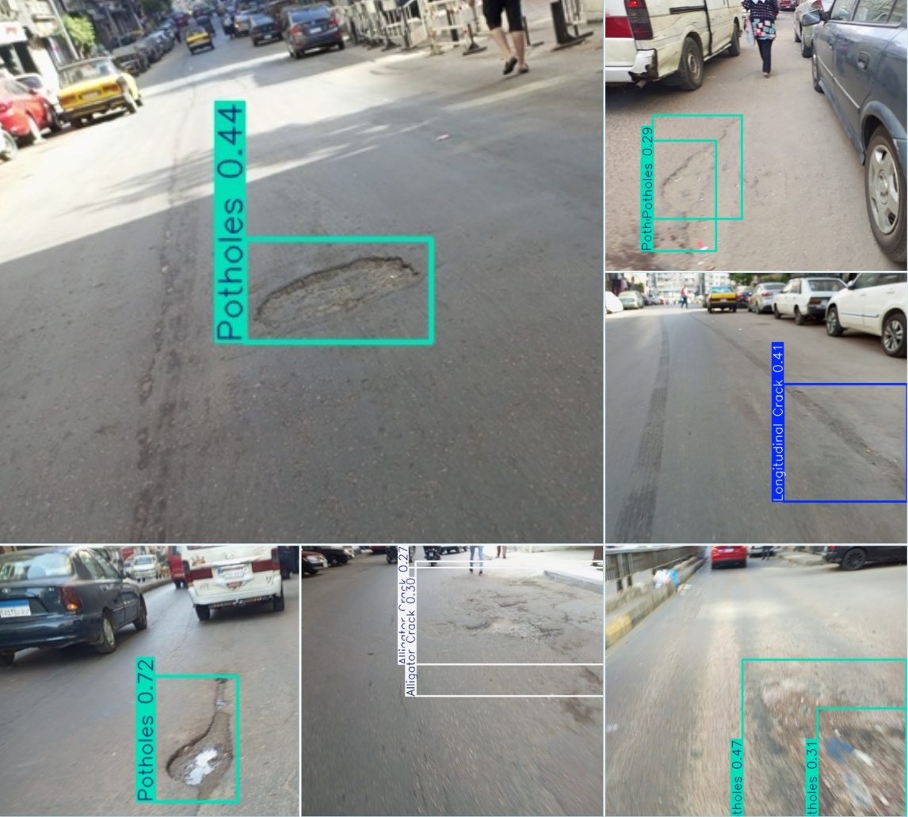

# PavementEye

<div align="center">
  
</div>

### What is PavementEye ?
##### Introduction
Roads  are  the  most  widely  used  transportation method  around  the  world  at  present.  One  of the causes  of accidents on the roads  is road  distresses [1]. 

If left untreated,  road  distresses  will  degrade  the  ride quality and safety of motorists. They will also require costly  maintenance  and  repairs,  which  can  restrict traffic flow  and cause congestion. Therefore, timely maintenance is  essential  to keep  highways safe  and durable. [2]

##### Problem

Roadsurface inspection is primarily based on visual observations by humans and quantitative analysis using expensive machines. Furthermore, it is timeconsuming. visual inspection tends to be inconsistent and unsustainable, which increases the risk associated with aging road infrastructure.[3]

##### Solution
We leverage our expertise in data science and data engineering to transform collected ideas and information into a comprehensive streaming data pipeline. This pipeline automatically collects images, processes them to detect cracks and classify their types using deep learning model, and performs data preprocessing. It enriches the analysis through integration with OpenStreetMap, enabling advanced geolocation insights. Images are stored in the cloud (data lake), while structured data is saved in a NoSQL database. All results are visualized in a unified dashboard, providing administrators with rapid, actionable insights. We called the application “Pavement Eye”.

<div align="center">
  
</div>

### Data Pipeline
<div align="center">
  
</div>

##### what Pavement-eye offers ?

1. A fast, reliable, and sustainable method for automatically detecting cracks using image processing—reducing manual effort and operational costs.

2. Utilizes persistent, fault-tolerant, and scalable storage solutions to manage various data types—including images, metadata, and analytics—ensuring high availability and data integrity.

3. Incorporates detailed spatial data, such as road networks from OpenStreetMap, to enable precise geolocation analysis and identify areas where cracks frequently occur.

4. Processes streaming data in real time, allowing immediate detection and classification of cracks for proactive infrastructure monitoring.

5. A centralized dashboard provides administrators with real-time visual insights, enabling quick identification and localization of cracks across monitored regions.

6. Automatically computes PCI to assess surface degradation and prioritize maintenance.

<div align="center">
  
</div>


## Steps to run the code

### Running Docker containers (Kafka, PySaprk, Cassandra)

Clone the repository

```powershell
git clone https://github.com/yahia997/PavementEye.git
cd PavementEye
```

Then to install docker images and run **for the first time.**

**Note: If you get an error that indicates `bitnami/spark:latest` was removed from docker hub, just change `bitnami/spark:latest` to `bitnamilegacy/spark:latest` in `compose.yaml` in the part of spark-master and spark-worker.**

You can read more information about that here: https://hub.docker.com/r/bitnami/spark

```powershell
docker compose up
```

This will install and run the containers.

If it is your not your first time to run the containers

```powershell
docker compose start
```

To stop the containers without deteting them

```powershell
docker compose stop
```

### Running the Flask API

1. Download the trained Yolo v8 model from:
https://github.com/oracl4/RoadDamageDetection/tree/main/models

**Note:** Put the model in the right place: `models\yolo v8`. Then the file should be as `models/yolo v8/YOLOv8_Small_RDD.pt`.

2. Download the required python libraries:
```powershell
pip install -r requirements.txt
```

3. Run the backend **(Ensure that you ran the docker containers first)**
```powershell
cd backend
python app.py
```

4. To access the dashboard to see the visualizations, In another terminal tab:
```powershell
cd streamlit
streamlit run "page 1.py"
```

**Note:** If you want to test cloud storage for images please contact yahiamahmoood333@gmail.com to get access credentials that are in `.env` file.

## References
[1]: Huang, Y.-H., & Zhang, Q.-Y., “A review of the causes and
effects of pavement distresses”, Construction and Building
Materials, Vol. 112, No. 1, pp. 294-305, 2016.

[2]: Kulshreshtha, S., & Zhang, X., “Pavement distresses and
their impact on pavement performance”, Journal of
Transportation Engineering, Part B: Pavements, Vol. 143,
No. 1, pp. 1-10, 2017.

[3]: Road Damage Detection Using Deep Neural Networks with
Images Captured Through a Smartphone, 2 Related Works
2.1 Road Damage Detection, Page 2
